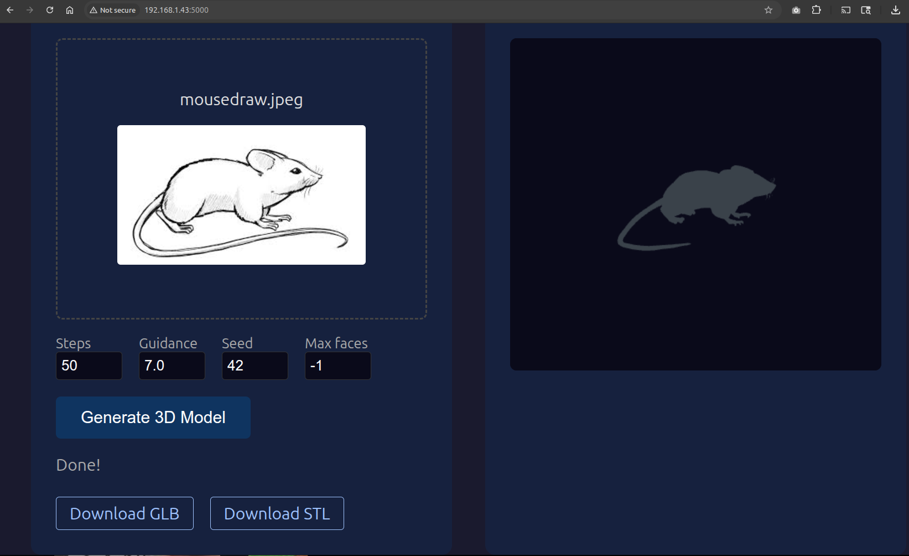

# TripoSG-WebUI
### Enhancement to https://github.com/VAST-AI-Research/TripoSG to add a WebUI.

Bring down the barrier of entry into 3D printing without having to learn Blender or CAD. Using this 


## TLDR
Clone TripoSG.
Clone this repo to get the python script for the WebUI.
`cp app.py pyproject.toml requirement.txt ~/code/TripoSG/`
Get it running in commandline, then run `uv run python app.py` to start the WebUI.

## Get TripoSG running
### TripoSG: High-Fidelity 3D Shape Synthesis using Large-Scale Rectified Flow Models
```bash
mkdir -p ~/code/
cd code
git clone https://github.com/VAST-AI-Research/TripoSG.git
git clone https://github.com/ErikAllanKincaid/TripoSG-WebUI.git
cp TripoSG-WebUI/app.py TripoSG-WebUI/pyproject.toml TripoSG-WebUI/requirement.txt ~/code/TripoSG/
cd TripoSG
uv init
uv venv
source .venv/bin/activate
uv pip install torch torchvision torchaudio --index-url https://download.pytorch.org/whl/cu124
uv pip install --no-build-isolation diso
uv add -r requirements.txt
uv pip install numpy
uv pip install huggingface-hub
uv pip install -r requirements.txt
```
### Add an image to try.
`scp ./mouse.jpg ops@192.168.1.43:/home/ops/code/TripoSG/`
### Run the generation model.
`IMAGE=mouse.jpg ; uv run python -m scripts.inference_triposg --image-input /home/erik/code/TripoSG/$IMAGE`

### Start the WebUI
`cd /home/$USER/code/TripoSG/ && uv run python app.py`

### Screenshot


####
parameters
Check out the [parameters](TripoSG-WebUI_Parameters-explained.txt)

## Make a service
`sudo cp triposg-webui.service /etc/systemd/system/` 
#### Copy service file to the service directory.
`sudo cp /home/$USER/code/TripoSG/triposg-webui.service  /etc/systemd/system/`
#### Reload systemd: Notify the service manager of the new file.
`sudo systemctl daemon-reload`
#### Start the service: Manually start the service for the first time.
`sudo systemctl start webui.service`
#### Check the service status: Verify that it is running correctly.
`sudo systemctl status webui.service`
#### Enable the service (optional): Configure the service to start automatically every time your system boots.
`sudo systemctl enable webui.service`
### Troubleshooting
If the service fails to start, use journalctl to view the logs and identify the error: 
`sudo journalctl -u webui.service -f`

## Docker

Run TripoSG-WebUI in a container with GPU support. Requires `nvidia-container-toolkit` on the host.

### Model Weights (~30GB)

The container expects model weights at `/app/pretrained_weights`. These are bind-mounted from your host machine so you can pre-download them or share them across containers.

**Option A: Pre-download on host (recommended)**

If you already have TripoSG running locally, you already have the weights. Point Docker at them:
```bash
TRIPOSG_WEIGHTS=/home/user/code/TripoSG/pretrained_weights docker compose up -d
```

To download weights without running TripoSG locally:
```bash
pip install huggingface_hub
huggingface-cli download VAST-AI/TripoSG --local-dir ./pretrained_weights
```

**Option B: Let the container download on first run**

If no weights are found at the mount path, the app downloads them automatically on startup. This takes a while on first run:
```bash
mkdir -p pretrained_weights
docker compose up -d
```

### Quick Start (docker compose)
```bash
docker compose up -d
# Access at http://localhost:5000
```

By default, weights are expected at `./pretrained_weights` relative to the compose file. Override with the `TRIPOSG_WEIGHTS` environment variable:
```bash
# Point to an existing weights directory
TRIPOSG_WEIGHTS=/path/to/pretrained_weights docker compose up -d

# Or set it in a .env file next to docker-compose.yml
echo "TRIPOSG_WEIGHTS=/home/user/code/TripoSG/pretrained_weights" > .env
docker compose up -d
```

Generated meshes are saved to `./outputs` by default. Override with `TRIPOSG_OUTPUTS`.

### Manual Docker
```bash
docker build -t triposg-webui .
docker run --gpus all -p 5000:5000 \
  -v /path/to/pretrained_weights:/app/pretrained_weights \
  -v /path/to/outputs:/app/outputs \
  triposg-webui
```

### Kubernetes
```bash
# Push image to your registry first
kubectl apply -f k8s-deployment.yaml
```

The k8s manifest includes:
- PersistentVolumeClaim for model weights (50Gi)
- GPU resource request (nvidia.com/gpu: 1)
- Liveness/readiness probes
- ClusterIP Service on port 80

## Problems TODO
- ~~The model produces a 3D mesh that is a 3D shape, but the polygon shape sides have no dimension, so when put in a slicer for printing it can not slice.~~ FIXED.
	- ~~The solution is to use Blender to create dimension, but this defeats the purpose of low barrier of entry.~~ FIXED.
- ~~The GPU does not release all the RAM once the model has run.~~ FIXED.
